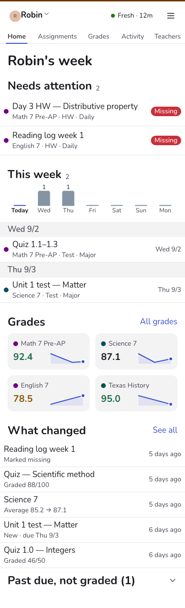
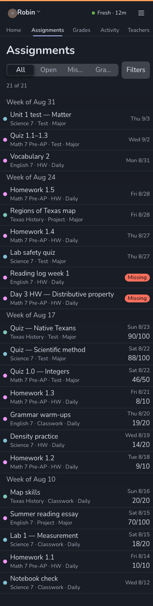
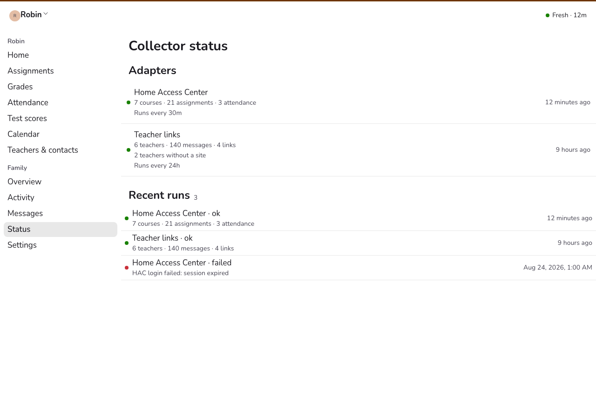
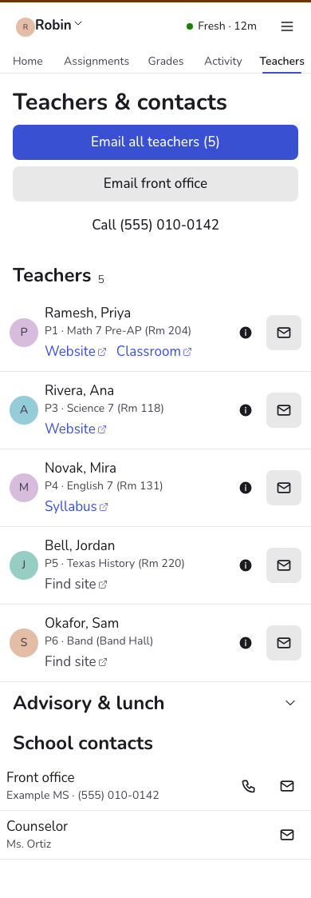
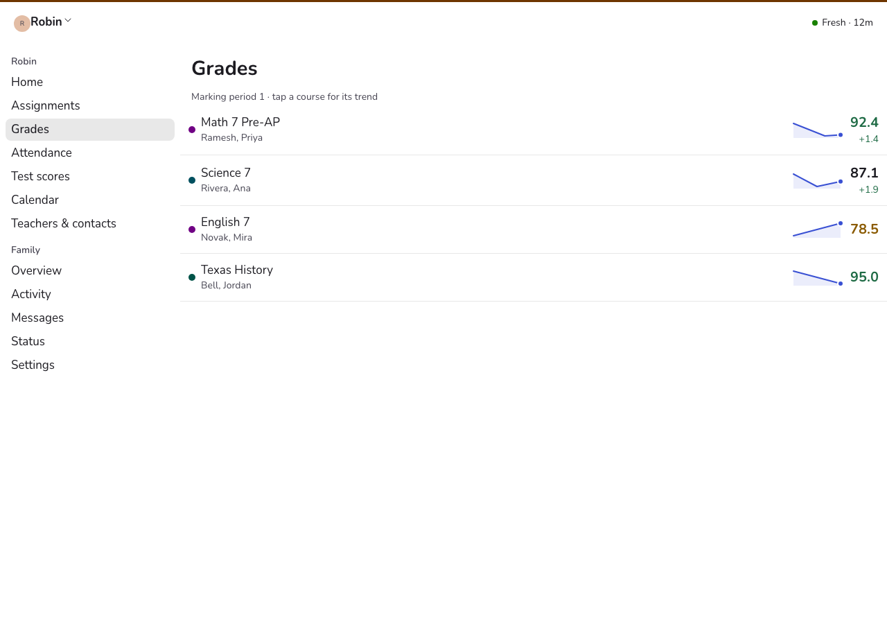

<h1 align="center">skoolie</h1>

<p align="center">
  <strong>A self-hosted dashboard for your kid's school data.</strong><br>
  It signs in to Home Access Center on a timer, pulls grades, assignments, attendance and test<br>
  scores into <em>your</em> Firebase project, and answers the only question you actually have:<br>
  <em>is anything missing, and what changed since I last looked?</em>
</p>

<p align="center">
  <a href="LICENSE"></a>
  
  
  <a href=".github/workflows/ci.yml"></a>
</p>

<p align="center">
  
  
</p>

<p align="center"><sub>All screenshots are the demo build — an invented family at an invented school.</sub></p>

---

## The problem

Home Access Center has everything and shows you none of it. Grades live behind a marking-period
dropdown, one course at a time. Missing work isn't a view — it's a status you find by scrolling. And
nothing tells you what *changed*: a zero posted on Tuesday looks exactly like a zero you already knew
about. So you either log in every day and re-read the whole gradebook, or you find out at the report
card.

skoolie logs in for you, every half hour, and keeps a copy. Because it keeps yesterday's copy too, it
can tell you the part HAC never will: **a new grade was posted, an assignment flipped to missing, a
course average moved.**

```
┌──────────────┐   HTTP + cheerio    ┌───────────────┐   diff vs.    ┌─────────────┐
│ Home Access  │ ──────────────────► │   collector   │ ──previous──► │  Firestore  │
│    Center    │   (your login)      │  (Node 22)    │    state      │  (yours)    │
└──────────────┘                     └───────────────┘               └──────┬──────┘
                                     systemd timer,                         │ realtime,
                                     every 30 min                           │ allowlisted
                                                                     ┌──────▼──────┐
                                                                     │   web app   │
                                                                     │  (React)    │
                                                                     └─────────────┘
```

Your data goes to a Firebase project **you** own and nowhere else. There is no skoolie server, no
account to sign up for, no telemetry. The only outbound calls are to your district's HAC, your
Firebase project, and — if you turn on the optional mail features — your own mailbox.

## Table of contents

- [See it in 30 seconds](#see-it-in-30-seconds)
- [What it does](#what-it-does)
- [Will it work with my district?](#will-it-work-with-my-district)
- [Setup](#setup)
- [How it fits together](#how-it-fits-together)
- [Development](#development)
- [Being a good citizen](#being-a-good-citizen)
- [Privacy and the law](#privacy-and-the-law)
- [Project status](#project-status)
- [License](#license)

## See it in 30 seconds

```bash
git clone https://github.com/lobsterclause/skoolie-oss && cd skoolie-oss
pnpm install
VITE_DEMO=1 pnpm dev:web     # → http://localhost:5173
```

That's the entire UI running on fixture data for an invented family. No Firebase project, no district
account, no sign-in, nothing written anywhere. Click around before you decide whether the rest is
worth your evening.

## What it does

### Collects, every run

| HAC page | What comes back |
|---|---|
| **Registration** | student name, grade, school, counselor |
| **Classes** | the schedule: course code and name, teacher, teacher email, period, room |
| **Assignments** | per course — title, category, assigned and due dates, score, max, weight, and a status (`upcoming` / `graded` / `missing` / `excused` / `late`), plus the course average. Current marking period by default; `--all-periods` for the whole year |
| **Attendance** | every non-Present period, by day, for the current and previous month |
| **Test Scores** | standardized-test history: scale scores, percentiles, Lexile, performance flags |

### Tells you what changed

Every run diffs against the previous state and writes `changeEvents`. That's what powers the feed on
the home screen and the Activity tab:

- `new_assignment` — work appeared on the gradebook
- `grade_posted` — a score landed
- `missing` — something flipped to missing
- `average_changed` — a course average moved, carrying the before and after
- `attendance` — an absence or tardy was recorded
- `new_message` — school mail arrived (with the inbox adapter on)
- `run_failed` / `reauth_needed` — the collector itself had a problem

### Tells you when it's lying

Every run also writes `families/<id>/runs/<runId>` with counts, warnings and errors. The UI shows a
freshness pill per source, so a stale dashboard announces itself instead of quietly showing you
last Tuesday's grades.

<p align="center">
  
</p>

### Optional: teacher links and school mail

HAC has no field for a teacher's website, and most campus directories don't publish one either. So
`--adapter links` reads your mailbox and harvests them: any message from a school domain (or one that
names exactly one of your kid's teachers) gets scanned for Google Sites, Classroom, Schoology, Canvas
and syllabus-doc links. Those become buttons on the Teachers tab, with the message they came from
shown as provenance.

`--adapter outlook` goes further and summarizes school mail into a Messages tab — category, a ≤90-word
summary, and action items with due dates. It's the only feature that calls a model, it never stores
message bodies, and it degrades to a deterministic summary without a token.

Both read via Microsoft Graph or plain IMAP, both strictly read-only, and both are off unless you
configure a mailbox.

<p align="center">
  
  
</p>

### Not yet

Assignment descriptions and attachments (`_AssignmentDialog`), report cards, Google Classroom, campus
calendars, and push notifications. See [issues](https://github.com/lobsterclause/skoolie-oss/issues).

## Will it work with my district?

**If your district uses Home Access Center, probably — with some selector surgery.**

Here's the honest version. HAC is a PowerSchool product deployed per-district, and districts skin it.
The URL paths are stock and unlikely to differ:

```
/HomeAccess/Account/LogOn
/HomeAccess/Content/Student/Registration.aspx
/HomeAccess/Content/Student/Assignments.aspx
/HomeAccess/Content/Student/Classes.aspx
/HomeAccess/Content/Attendance/MonthlyView.aspx
/HomeAccess/Content/Student/TestScores.aspx
```

The *markup inside them* is where districts diverge. This adapter was built against one district's
HAC, so the selectors in
[`services/collector/src/adapters/hac/parse.ts`](services/collector/src/adapters/hac/parse.ts)
reflect that one. Some are stock ASP.NET control ids that are stable everywhere
(`plnMain_lblRegStudentName`); others are classes that a district theme could rename.

**Find out in five minutes**, without writing to anything:

```bash
cd services/collector
cp .env.example .env      # set HAC_BASE_URL, HAC_USERNAME, HAC_PASSWORD, SKOOLIE_FAMILY_ID
pnpm exec tsx src/run.ts --adapter hac --dry-run --dump
```

`--dry-run` prints the normalized JSON and writes nothing. `--dump` saves the raw HTML it fetched.
Three outcomes:

- **It all parses.** Drop `--dry-run` and you're running.
- **Some pages come back empty.** The run's `warnings` name them. Open the matching dump, find what
  your district calls that element, and fix the selector. This is usually a one-line change.
- **Login fails.** Check that `HAC_BASE_URL` is just the scheme and host, and that your account isn't
  locked. The client mimics the standard HAC login postback including the ASP.NET viewstate dance.

If you get a district working, **please open a PR** — a selector fix plus a synthetic fixture
reproducing your markup is exactly the contribution this project needs. See
[CONTRIBUTING.md](CONTRIBUTING.md).

### What about a different system entirely?

Nothing outside `adapters/hac/` knows HAC exists. An adapter's whole job is to produce the
zod-validated shapes in [`packages/shared`](packages/shared); the diff, the Firestore sink, the
security rules and the entire UI work from those. A PowerSchool-proper, Infinite Campus or Skyward
adapter should not need to touch anything downstream. `Source` in the schema is already an enum with
room in it.

## Setup

The full walkthrough — including Firebase, service accounts, the systemd timer, and mail — is in
**[docs/runbook.md](docs/runbook.md)**. The shape of it:

1. **Firebase project.** Create one, enable Firestore and Google sign-in, then `firebase use --add`
   in `firebase/`.
2. **Deploy the rules first**, before anything writes: `firebase deploy --only firestore`.
3. **Web config.** `cp apps/web/.env.example apps/web/.env` and fill in from the Firebase console.
4. **Collector config.** `cp services/collector/.env.example services/collector/.env` — `HAC_BASE_URL`,
   your HAC credentials, and a service-account JSON path.
5. **Seed the allowlist**, or you can't sign in to your own dashboard:
   `pnpm --filter @skoolie/collector exec tsx src/scripts/seed.ts --family <id> --parent you@example.com`
6. **Dry run, then real run**, then put it on a timer ([`deploy/`](deploy/collector/README.md)).

You need: Node 22+, pnpm, a Firebase project (the free tier is plenty), somewhere to run a container
on a schedule, and a JRE if you want to run the Firestore rules tests locally.

## How it fits together

```
packages/shared ──── zod schemas: the contract both sides obey
       ▲                                    ▲
       │                                    │
services/collector                      apps/web
  adapters/hac/    HTTP + cheerio         pages/    one route per tab
  diff/            what changed           lib/      pure logic, unit-tested
  inbox/ links/    optional mail          charts/   sparklines, trends
  sink/firestore   batched writes         firebase.ts  auth + realtime reads
       │                                    ▲
       └──────────► Firestore ──────────────┘
                    firebase/firestore.rules gates every read
```

Each package has its own README with the detail:

| Package | What's in it |
|---|---|
| [`packages/shared`](packages/shared/README.md) | Every Firestore document shape, as zod. Start here to understand the data. |
| [`services/collector`](services/collector/README.md) | The HAC adapter, the diff, the CLI, and **how to adapt it to your district**. |
| [`apps/web`](apps/web/README.md) | The dashboard: routes, demo mode, the Astryx theme pipeline. |
| [`firebase`](firebase/README.md) | The security model — who can read what, and the tests that prove it. |
| [`deploy/collector`](deploy/collector/README.md) | Docker, compose, systemd units, and operating it. |

### The Firestore tree

```
families/{familyId}                       allowlist, school contacts, teacherLinks
  members/{uid}                           role, studentIds, prefs (the only client-writable doc)
  students/{studentId}                    name, grade, school, counselor
    courses/{courseId}                    teacher, period, room, currentAverage
    assignments/{assignmentId}            title, dates, score, status, weight
    attendance/{date}                     non-Present periods for that day
    testScores/{testId}                   standardized-test history
  changeEvents/{eventId}                  what changed, and when
  messages/{messageId}                    school-mail summaries (parent-only)
  runs/{runId}                            collector health: counts, warnings, errors
```

Clients never write anything except their own `prefs`. The collector uses the Admin SDK, which
bypasses rules entirely — so the rules exist purely to constrain *readers*, and
[`firebase/test/rules.test.ts`](firebase/test/rules.test.ts) proves they do.

## Development

```bash
pnpm install
pnpm verify                  # typecheck + unit tests + Firestore rules tests  ← the gate
pnpm dev:web                 # http://localhost:5173
VITE_DEMO=1 pnpm dev:web     # ...on fixture data, no Firebase needed
```

`pnpm verify` is the contract: **green before anything is done.** It needs a JRE for the Firestore
emulator (`brew install openjdk@21` on macOS) and takes a few seconds.

```bash
pnpm verify:full             # + mutation testing (Stryker) + Playwright e2e
pnpm --filter @skoolie/web shots    # 64 screenshots, fails on console errors or overflow
```

CI runs verify, e2e and mutation testing on every PR. The mutation suite is scoped to the pure logic
(`lib/`, the collector's parsers and diff) where it carries signal.

Testing philosophy, briefly: parsers are pinned by golden fixtures, pure logic has unit tests beside
it, the security rules have their own emulator suite, and the visual gate catches layout regressions
that types can't. There's no mocking of HAC itself — the fixtures *are* HAC.

## Being a good citizen

HAC is a school district's production system, and usually not a well-resourced one. The collector is
deliberately gentle. Please keep it that way:

- **It reuses one login.** Session cookies persist to `SKOOLIE_SESSION_FILE`, so a run doesn't
  re-authenticate. HAC visibly degrades after a burst of fresh logins.
- **It spaces requests** with random 400–1800 ms gaps.
- **Every 30 minutes during school hours is plenty.** Nothing here gets better by polling harder.
- **Don't loop the probe scripts** in `src/scripts/` against a live server. They exist for
  one-off exploration.
- **Use your own credentials, for your own children.** This logs in as you and reads only pages you
  can already open in a browser. That's the whole justification; don't undermine it.

Check your district's acceptable-use policy. Some are explicitly fine with parents automating their
own access; some aren't; most have never thought about it.

## Privacy and the law

This copies a child's education records onto infrastructure you control. In the US those records are
protected by FERPA *while the school holds them* — once they're in your Firebase project, the law
isn't what's protecting them, you are.

What the project does to help:

- **Firestore rules gate every read** on an explicit per-family allowlist plus a member document, and
  per-student on that member's `studentIds`. Both are required. Message summaries are parent-only.
- **`pnpm verify` runs the rules tests**, so you can't quietly break the gate.
- **Message bodies are never stored** — only summaries.
- **`--dump` output is gitignored** and every committed fixture is synthetic.

What's on you:

- Don't make the Firebase project public, and don't hand out the service-account key.
- Put only people who should see a child's records on the allowlist.
- **Never attach real data to an issue or PR.** Not a dump, not a screenshot, not a Firestore export.
  [SECURITY.md](SECURITY.md) explains how to report a bug that involves real data safely.

## Project status

Honest expectations:

- This runs a real family's dashboard every day, so it's maintained, but it's a **side project** —
  issues and PRs get looked at when they get looked at.
- It has been exercised against **one district's HAC**. Yours will differ; see
  [above](#will-it-work-with-my-district).
- The schemas in `packages/shared` are stable in practice but not versioned. There's no migration
  tooling; if a shape changes, the collector rewrites the documents on its next run.
- Google Classroom was investigated and abandoned — the API has no guardian-scoped read path, so a
  parent simply cannot get a student's coursework. Mail harvesting exists because of that dead end.

Contributions welcome, especially district compatibility — [CONTRIBUTING.md](CONTRIBUTING.md).

## License

[Apache-2.0](LICENSE) — see [NOTICE](NOTICE).

Not affiliated with, endorsed by, or supported by PowerSchool or any school district. "Home Access
Center" is PowerSchool's trademark; this is an independent client that signs in with your own
credentials.
